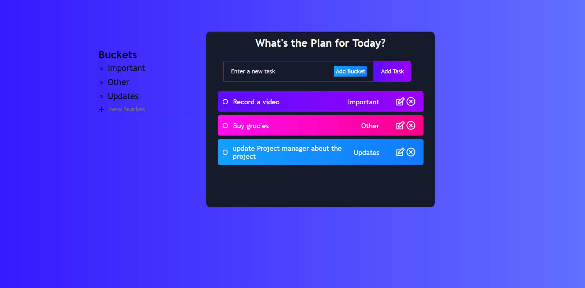

# todo-app

This is a simple Todo-list application with following features
1. Create bucket(label that can be assigned to a task/todo)
2. Create a task under a bucket.
3. Complete/Edit and Delete tasks

To run the Application - clone the repository and run following commands
1. npm install
2. Connect your mongodb database in server.js
3. npm run dev

